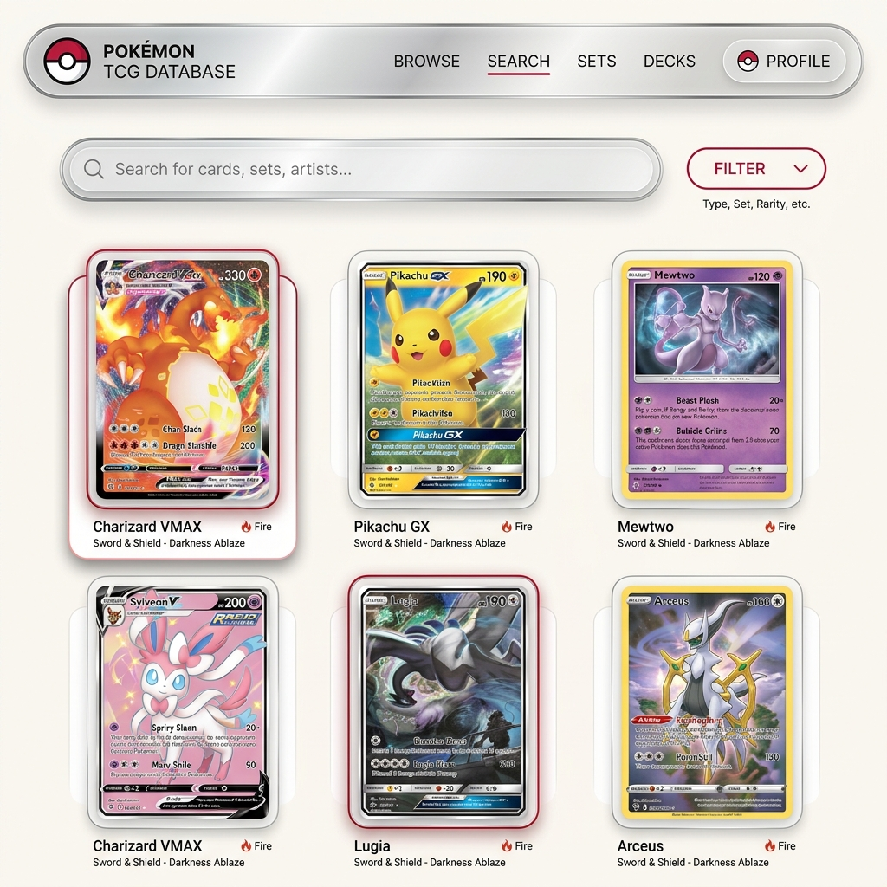
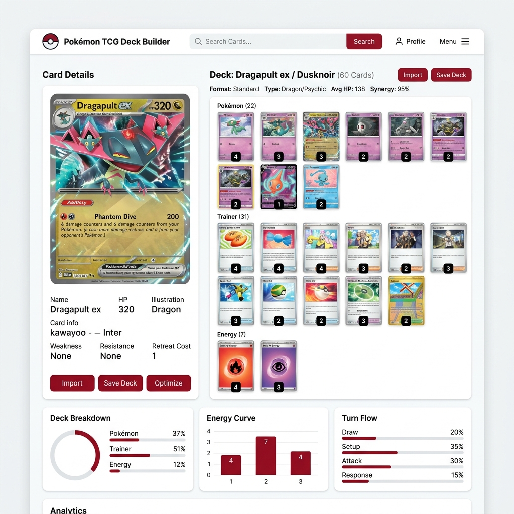
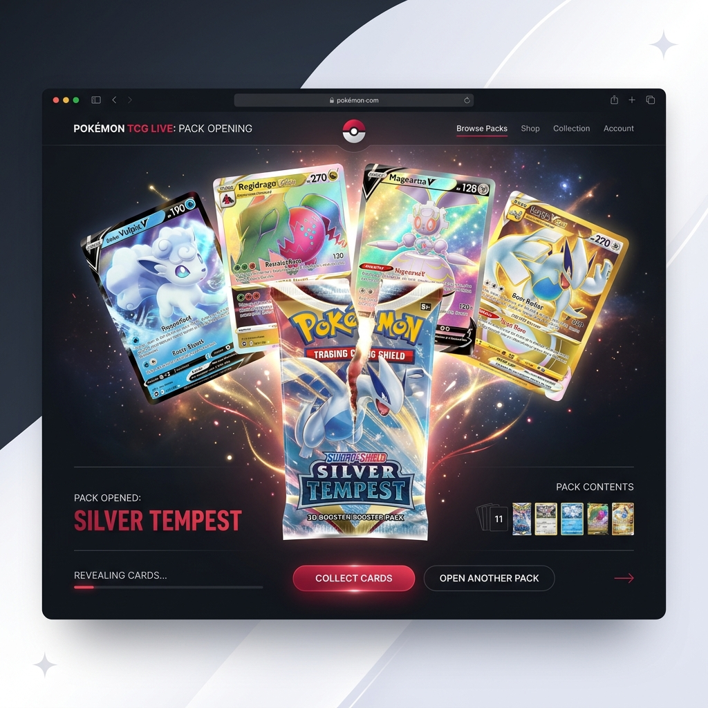
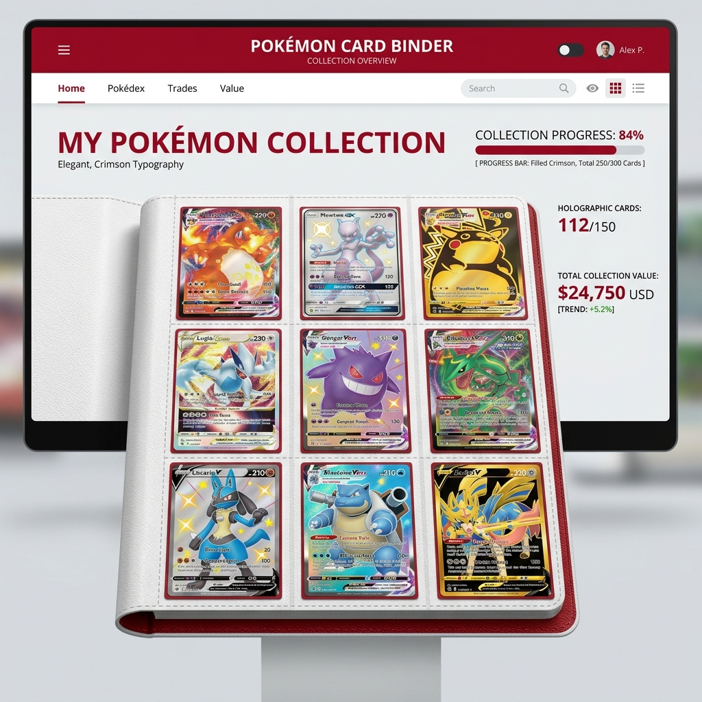
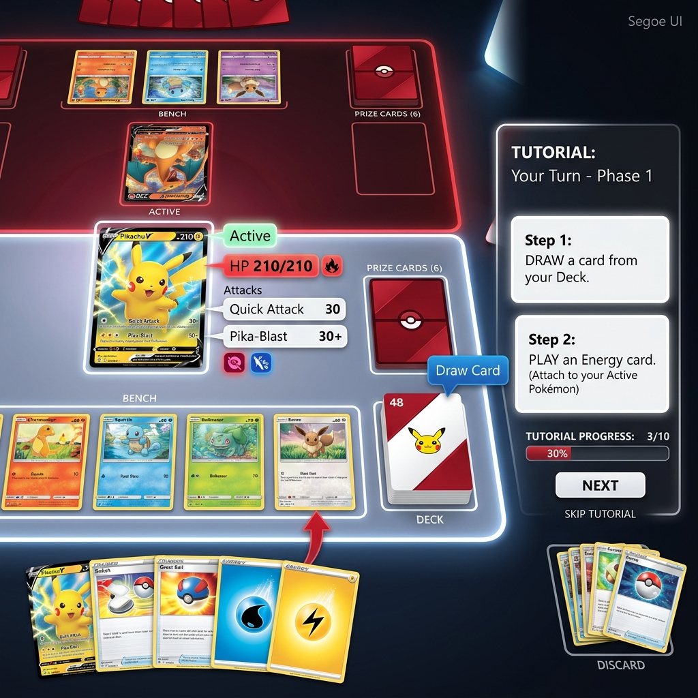

# 🃏 โครงร่างและแนวทางการพัฒนาเว็บไซต์ Pokémon TCG สุดพรีเมียม (Premium Pokémon TCG Web Application)

ปรับเปลี่ยนแนวคิดของเว็บไซต์ให้มุ่งเน้นไปที่ **Pokémon Trading Card Game (TCG)** โดยเฉพาะ เพื่อสร้างแพลตฟอร์มที่เป็นทั้งแหล่งค้นหาการ์ด จัดเด็ค และสะสมการ์ดแบบเสมือนจริงที่น่าดึงดูดใจที่สุด

---

## 1. 🔍 ระบบค้นหาและฐานข้อมูลการ์ดอัจฉริยะ (Pokémon TCG Database Search)

*แนวคิด: ค้นหาการ์ดทุกใบในประวัติศาสตร์ของ Pokémon TCG ได้อย่างรวดเร็วและสวยงาม*

* **รูปแบบการนำเสนอ (Presentation):**
  * **3D Holographic Hover Cards:** เมื่อผู้ใช้เลื่อนเมาส์ผ่านการ์ด การ์ดจะเอียงสามมิติตามทิศทางของเมาส์ พร้อมเอฟเฟกต์แสงสะท้อนเลื่อมรุ้ง (Holographic Foil effect) เพื่อเลียนแบบหน้าการ์ดจริง
  * **Multi-dimensional Search:** ค้นหาตามประเภท (Pokémon, Trainer, Energy), ธาตุ, เซตการ์ด (Expansion sets เช่น Scarlet & Violet, Base Set), ความหายาก (Rarity เช่น Illustration Rare, Gold UR), และชื่อนักวาดภาพประกอบ (Illustrator)
* **ประเด็นที่น่าสนใจเพิ่มเติม (Features to Add):**
  * **Real-time Market Pricing:** ดึงข้อมูลราคากลางจากตลาดการ์ด (เช่น TCGPlayer, Cardmarket) มาแสดงผลให้เห็นมูลค่าปัจจุบันทันที
  * **Card Legality Checker:** แสดงผลอย่างชัดเจนว่าการ์ดใบนี้สามารถใช้เล่นในทัวร์นาเมนต์รูปแบบใดได้บ้าง (Standard, Expanded, Unlimited)

---

## 2. 🎴 ระบบจัดเด็คเสมือนจริง (Interactive Deck Builder)

*แนวคิด: เครื่องมือลากวางจัดเด็คขนาด 60 ใบ พร้อมระบบตรวจกติกาแบบ Real-time*

* **รูปแบบการนำเสนอ (Presentation):**
  * **Visual Deck Canvas:** แบ่งพื้นที่หน้าจอเป็นสองฝั่ง ฝั่งซ้ายคือผลการค้นหาการ์ด ฝั่งขวาคือเด็คแคนวาสที่ให้ผู้ใช้คลิกเลือกหรือลากการ์ดมาใส่ในเด็คได้อย่างราบรื่น
  * **Deck breakdown charts:** แสดงอัตราส่วนสัดส่วนการ์ดระหว่าง Pokémon, Trainer และ Energy ในเด็คเป็นกราฟวงกลมหรือกราฟแท่งที่สวยงาม
* **ประเด็นที่น่าสนใจเพิ่มเติม (Features to Add):**
  * **Deck Validator:** แจ้งเตือนข้อผิดพลาดโดยอัตโนมัติ เช่น การ์ดต้องครบ 60 ใบพอดิบพอดี หรือใส่การ์ดชื่อเดียวกันเกิน 4 ใบ (ยกเว้น Basic Energy)
  * **Sample Hand Test Simulator:** ฟังก์ชันจำลองการจั่วการ์ดแรกเริ่ม 7 ใบ (Starting Hand) เพื่อให้ผู้จัดเด็คได้ลองประเมินว่าเด็คที่จัดมีโอกาส "เกลือ" หรือเริ่มต้นได้ดีแค่ไหน
  * **Export/Import Text:** รองรับโค้ดนำเข้าและส่งออกที่เป็นมาตรฐานสากล (รองรับการนำเข้าโค้ดเด็คจาก Pokémon TCG Live)

---

## 3. 📦 เครื่องจำลองการเปิดซองการ์ดสุดอลังการ (3D Booster Pack Opening Simulator)

*แนวคิด: มอบประสบการณ์สุดเร้าใจในการลุ้นเปิดซองสุ่มการ์ดเหมือนได้จับซองจริง*

* **รูปแบบการนำเสนอ (Presentation):**
  * **3D Pack Opening Animation:** มีโมเดลซองการ์ดแบบ 3D ให้ผู้ใช้ใช้นิ้วหรือเมาส์ "ฉีก" ซองการ์ดออก จากนั้นให้สไลด์เปิดการ์ดทีละใบจากซอง
  * **Special Card Visual FX:** เมื่อเจอการ์ดระดับหายาก (เช่น Secret Rare หรือ Alt Art) จะมีเสียงประกอบพิเศษ แสงระเบิดอลังการ และประกายไฟวิบวับพุ่งขึ้นมา
* **ประเด็นที่น่าสนใจเพิ่มเติม (Features to Add):**
  * **Historic Packs Selection:** เลือกเปิดซองย้อนหลังได้ตั้งแต่ยุคคลาสสิก (Base Set 1999) ไปจนถึงเซตล่าสุดในปัจจุบัน
  * **Share Pack Results:** ปุ่มแชร์ผลการเปิดซองลง Social Media ในรูปการ์ด Grid รวมที่จัด Layout ให้ดูสวยงามทันที

---

## 4. 🗂️ อัลบั้มสะสมการ์ดส่วนตัวดิจิทัล (Digital Collection Binder)

*แนวคิด: สมุดเก็บการ์ดสะสมส่วนตัวที่ช่วยให้รู้สึกถึงความเป็นเจ้าของการ์ดใบโปรด*

* **รูปแบบการนำเสนอ (Presentation):**
  * **Virtual Binder View:** หน้าอินเตอร์เฟสจำลองสมุดเก็บการ์ดแบบ 9 ช่องต่อหน้า ที่สามารถ "พลิกหน้ากระดาษ" เพื่อดูการ์ดหน้าถัดไปด้วยแอนิเมชัน 3D
  * **Collection Progress Tracker:** แสดงเปอร์เซ็นต์การสะสมการ์ดครบเซตเป็น Progress Bar (เช่น Scarlet & Violet: 80% Complete)
* **ประเด็นที่น่าสนใจเพิ่มเติม (Features to Add):**
  * **Total Collection Value:** คำนวณมูลค่าการ์ดสะสมรวมของผู้ใช้ทั้งหมดแบบ Real-time โดยอิงตามราคากลางการ์ดปัจจุบัน
  * **Wishlist Integration:** ระบบจดรายการการ์ดที่กำลังตามหาเพื่อความสะดวกในการซื้อขายแลกเปลี่ยน

---

## 5. 📖 ระบบคู่มือและจำลองการเล่นพื้นฐาน (Interactive Gameplay Tutorial)

*แนวคิด: สอนกฎกติกาการเล่นการ์ดแบบเข้าใจง่ายและเห็นภาพจริง ไม่ใช่แค่การอ่านตัวหนังสือยาวๆ*

* **รูปแบบการนำเสนอ (Presentation):**
  * **Interactive Board Setup Guide:** หน้าจอจำลองกระดานเล่น (Playmat) ที่จัดวางองค์ประกอบต่างๆ (Active Pokémon, Bench, Deck, Prize Cards, Discard Pile, Lost Zone) พร้อมการ์ดที่สามารถคลิกเพื่ออ่านคำแนะนำการใช้งานของแต่ละโซนได้แบบเข้าใจง่าย
  * **Step-by-Step Visual Tutorial:** บทเรียนสไลด์แบบ Interactive อธิบายขั้นตอนใน 1 เทิร์น (Draw, Bench/Evolve Pokémon, Attach Energy, Use Trainer Cards, Attack)
  * **Visual Mechanics Simulator:** หน้าทดลองลาก Energy ไปติดให้โปเกมอน และกดสั่งใช้ท่าต่อสู้ (Attack) เพื่อโจมตีโปเกมอนเป้าหมาย โดยระบบจะคำนวณแดมเมจและหักพลังชีวิต (HP) ของการ์ดเป้าหมายให้ดูแบบ Real-time
* **ประเด็นที่น่าสนใจเพิ่มเติม (Features to Add):**
  * **Animated Status Guide:** แอนิเมชันสั้นแสดงสถานะผิดปกติต่างๆ (เช่น หลับ - Sleep การ์ดจะหมุนแนวนอน, สับสน - Confused การ์ดจะหมุนกลับหัว) พร้อมสัญลักษณ์คำอธิบาย
  * **Interactive Rule Quiz:** มินิเกมทดสอบความเข้าใจกติกาหลังเรียนจบ หากตอบถูกครบจะได้รับตั๋วสำหรับนำไปเปิดซองการ์ดในระบบ Booster Pack Simulator
  * **Quick Terminology Lookup:** แถบค้นหาความหมายของคำศัพท์เฉพาะทางในเกมอย่างรวดเร็ว (เช่น Rule Box, Retreat Cost, Weakness, Resistance)

---

## 🎨 ทิศทางการออกแบบสไตล์พรีเมียมสำหรับ TCG (Design & Aesthetics)
* **Theme:** สไตล์ **Elegant Red & White Minimalist (พรีเมียม แดง-ขาว-เงิน)**
  * คอนเซปต์แรงบันดาลใจจากสีของ **"โปเกบอล (Pokéball)"** นำมาออกแบบให้มีความเรียบหรูและพรีเมียมสูง (Minimalist Luxury)
  * ใช้สีพื้นหลังขาวสะอาด (Pristine White / Off-white) ตัดด้วยสีแดงคริมสัน/แดงรูบี้ระดับหรูหรา (Crimson Red / Deep Ruby Red) เสริมรายละเอียดขอบหรือไอคอนด้วยสีเงินเมทัลลิก (Metallic Silver / Platinum) และสีชาร์โคลอ่อน (Soft Charcoal) เพื่อสร้างมิติและความเป็นระเบียบ
  * การจัดเลย์เอาต์แบบเน้นพื้นที่ว่าง (White Space) เส้นขอบบางเฉียบ (Thin Borders) และเอฟเฟกต์กระจกฝ้า (Soft Glassmorphism) ที่มีแสงสะท้อนโทนขาวแดงละมุนตา
* **Micro-interactions:** 
  * แอนิเมชันการหยิบการ์ด ย้ายการ์ด และการพลิกการ์ด (Card Flip Animation) ที่ลื่นไหลนุ่มนวลระดับ 60 FPS
  * แสนสะท้อน Foil Shader (ใช้ CSS Gradient + Blend Mode) บนหน้าการ์ดที่เปลี่ยนมุมตกกระทบของแสงสีรุ้ง/สีเงินเมทัลลิกตามการเคลื่อนไหวของเมาส์
* **API Integration:** ใช้ [pokemontcg.io API](https://pokemontcg.io) ในการดึงภาพการ์ดความละเอียดสูง (Hi-res images) และข้อมูลการ์ดทั้งหมดเพื่อการแสดงผลที่คมชัดสูงสุด